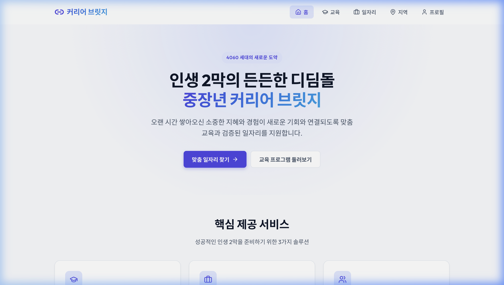
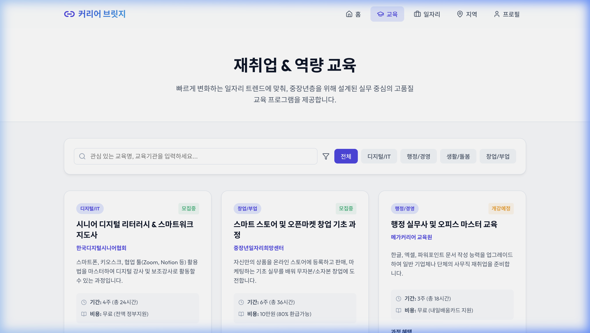
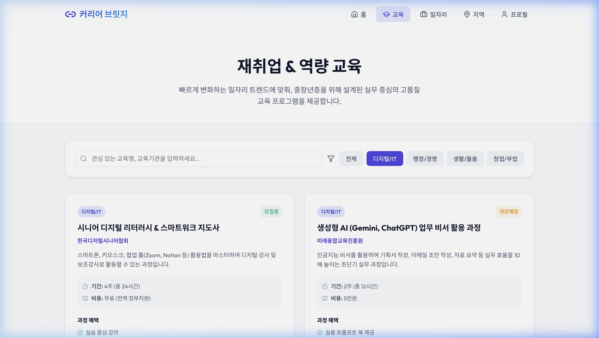
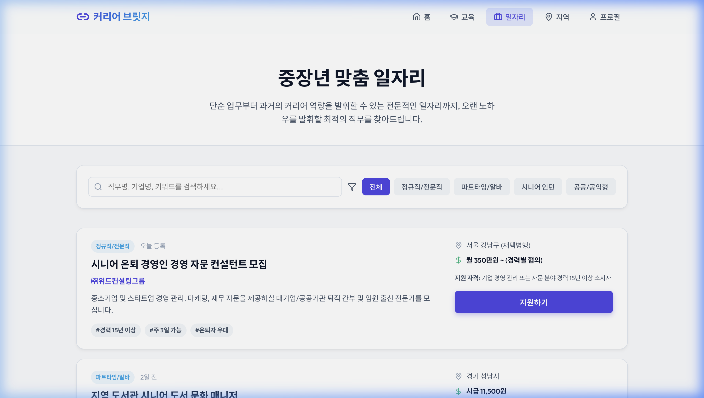
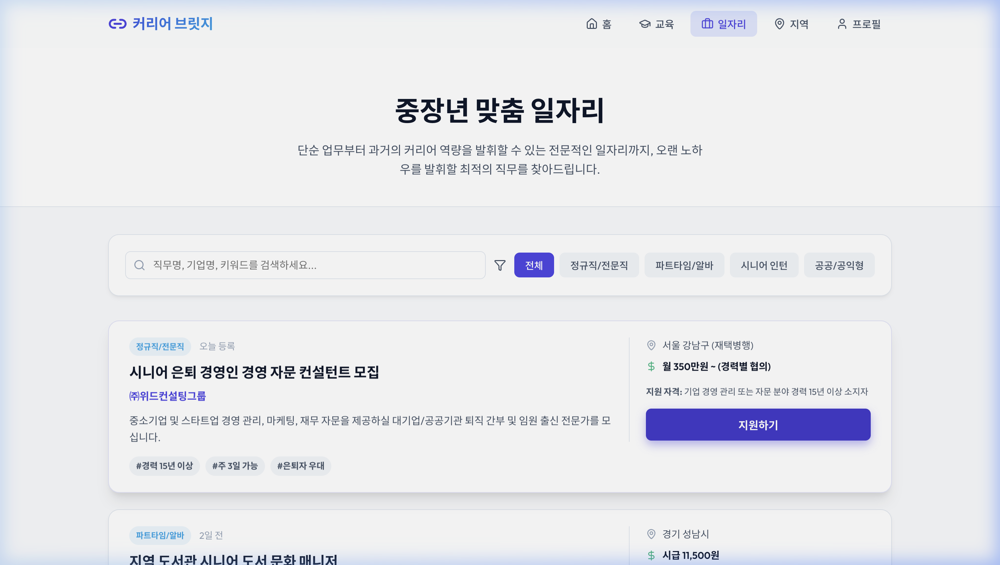
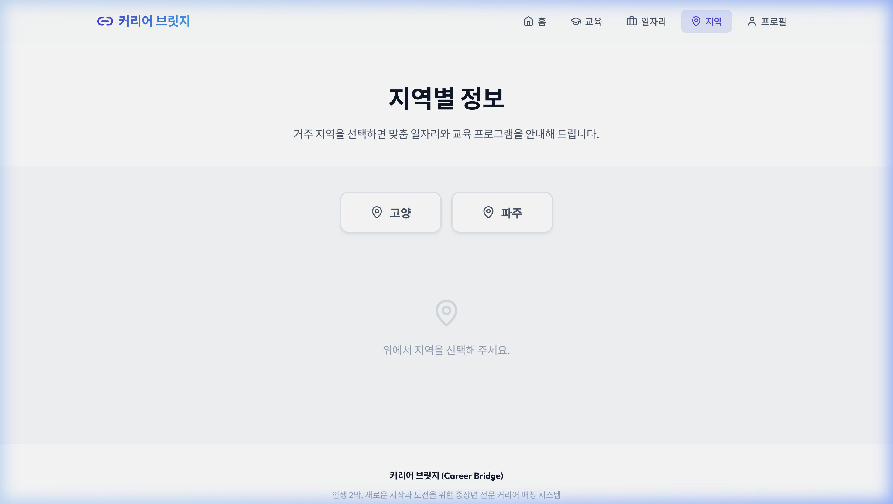
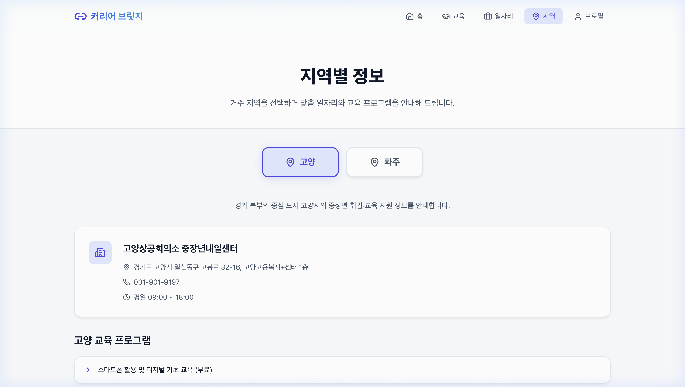
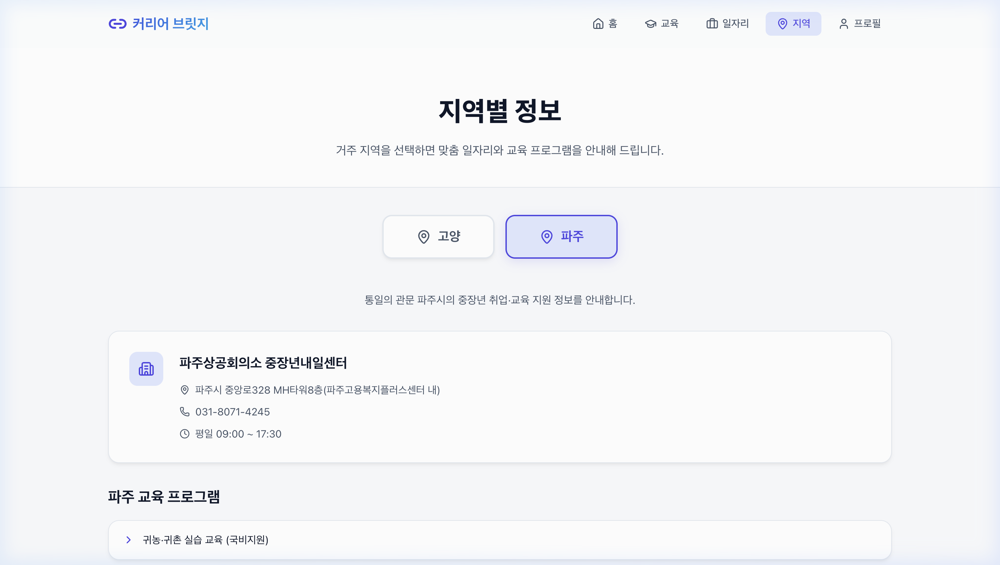
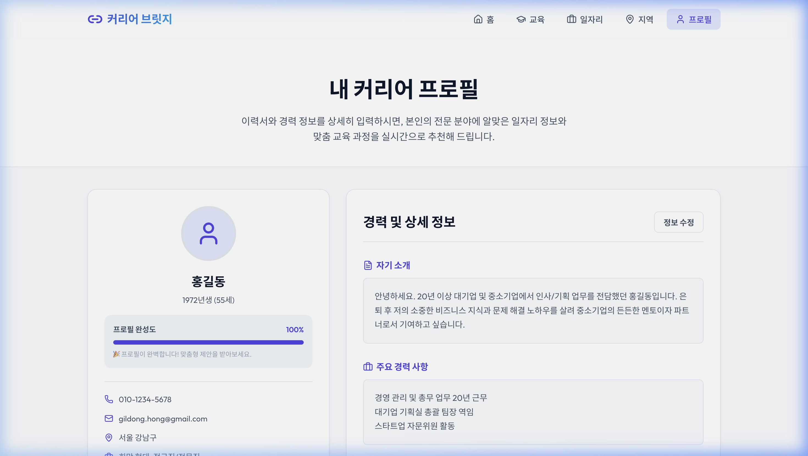
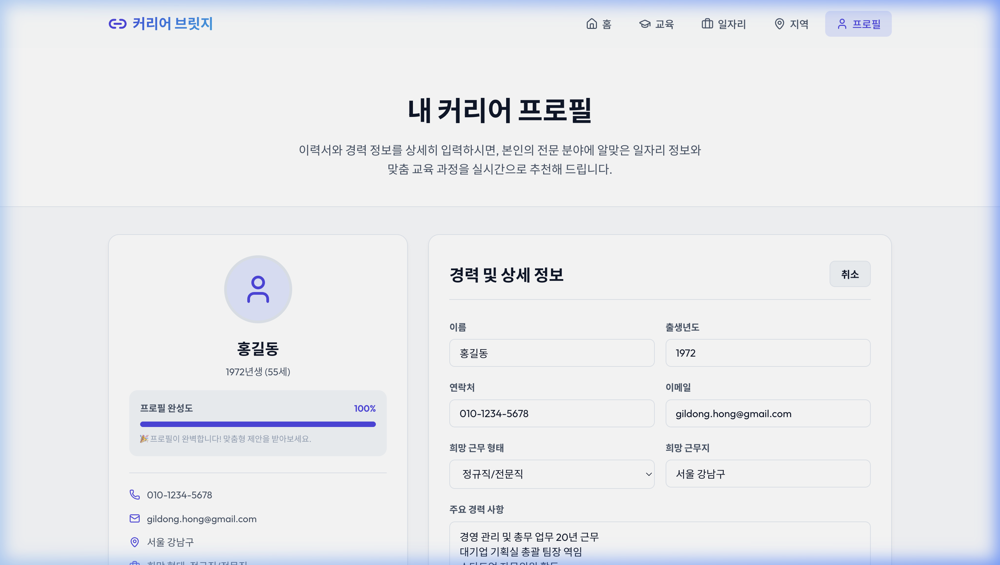

# 📸 중장년 커리어 브릿지 (Career Bridge) 기능별 화면 설명서

본 문서는 중장년 커리어 브릿지 플랫폼의 기능 동작과 UI 구성을 각 화면별 설명과 스크린샷 이미지로 안내합니다.
*(모든 이미지는 프로젝트 폴더 내 `screenshots/` 디렉토리에 저장되어 있습니다.)*

---

## 1. 홈 화면 (Home)

### 📌 메인 홈 대시보드
* **파일명:** `1_home.png`
* **설명:** 4060 중장년 세대의 비전과 가치관을 함축적으로 표현한 히어로 배너입니다. 핵심 제공 서비스 카드 링크를 배치하여 클릭 한 번으로 원하는 탭으로 이동할 수 있습니다. 또한 우측의 빠른 정보 확인 패널을 통해 수강 가능한 강좌 수, 일자리 정보 건수, 취업 성공률 지표를 역동적으로 제공합니다.

---

## 2. 교육 프로그램 화면 (Education)

### 📌 교육 강좌 전체 리스트
* **파일명:** `2_education_all.png`
* **설명:** 중장년층 취업 및 창업에 특화된 국비지원 및 무료 교육 강좌들이 직관적인 카드형 레이아웃으로 표시됩니다. 수강 기간, 비용 혜택 및 상세 코스별 강점이 포함되어 있습니다.

### 📌 교육 카테고리 필터링 적용
* **파일명:** `3_education_filtered.png`
* **설명:** `디지털/IT` 등의 카테고리 태그 버튼을 클릭하거나, 강좌명을 키워드로 검색하여 나에게 알맞은 교육만 동적으로 실시간 필터링하여 보여줍니다.

---

## 3. 일자리 매칭 화면 (Jobs)

### 📌 중장년 전용 구인 정보
* **파일명:** `4_jobs_all.png`
* **설명:** 시니어 전문직, 파트타임, 시니어 인턴, 공공근로 등 중장년층 선호 직무 분류별로 채용 공고를 확인할 수 있습니다. 공고마다 급여(시급/월급), 근무 형태, 모집 조건 등이 명확히 드러납니다.

### 📌 일자리 즉시 지원 기능
* **파일명:** `5_jobs_applied.png`
* **설명:** 구인 카드 우측의 `지원하기` 버튼을 누르면 이력서 제출 절차와 프로필 연동을 유도하는 인터랙티브 얼럿창이 발생하여 원활한 취업 준비를 돕습니다.

---

## 4. 지역별 정보 화면 (Region)

### 📌 지역 선택 전 대기 상태
* **파일명:** `6_region_init.png`
* **설명:** 새로 추가된 지역별 맞춤 탭입니다. 거주하시는 지역을 선택하기 전, 깔끔하게 지도 핀 아이콘과 함께 안내가 나타납니다.

### 📌 '고양시' 맞춤 정보 화면
* **파일명:** `7_region_goyang.png`
* **설명:** `고양` 버튼을 누르면 고양상공회의소 중장년내일센터의 상세 위치(주소), 대표번호, 운영 시간과 고양시에서만 운영 중인 맞춤형 교육 프로그램 및 추천 일자리가 동적으로 매핑되어 나타납니다.

### 📌 '파주시' 맞춤 정보 화면
* **파일명:** `8_region_paju.png`
* **설명:** `파주` 버튼을 누르면 파주상공회의소 중장년내일센터 안내와 더불어 출판단지 물류 관리, 임진각 해설사, 시니어 스쿨팜 등 파주 특화 채용 정보와 맞춤 강좌가 로드됩니다.

---

## 5. 프로필 관리 화면 (Profile)

### 📌 커리어 이력서 요약 및 완성도
* **파일명:** `9_profile_view.png`
* **설명:** 개인 기본 정보와 경력 사항, 보유 기술 태그가 보기 좋게 나열됩니다. 상단에는 작성 완료 항목 개수에 따른 '프로필 완성도(%)' 프로그레스 바가 시각적으로 표시됩니다. 작성 데이터는 브라우저를 종료해도 유실되지 않도록 로컬 저장소(`localStorage`)에 저장됩니다.

### 📌 인풋 필드 정보 편집 모드
* **파일명:** `10_profile_edit.png`
* **설명:** `정보 수정` 버튼을 눌러 활성화된 화면입니다. 이름, 연도, 연락처, 세부 경력, 보유 기술, 자기소개 문구를 자유롭게 편집한 뒤 즉시 저장하여 업데이트할 수 있습니다.

