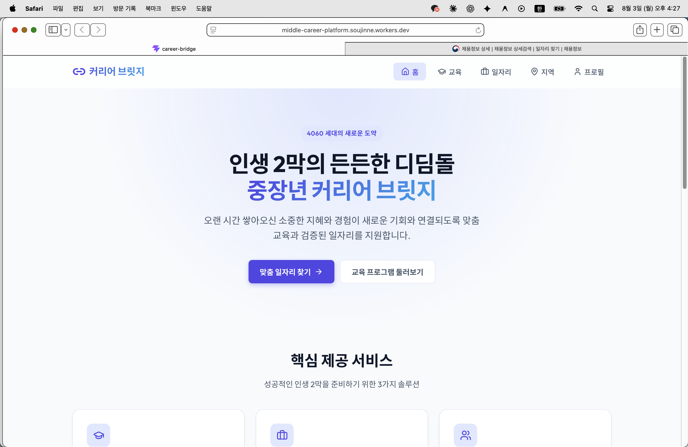
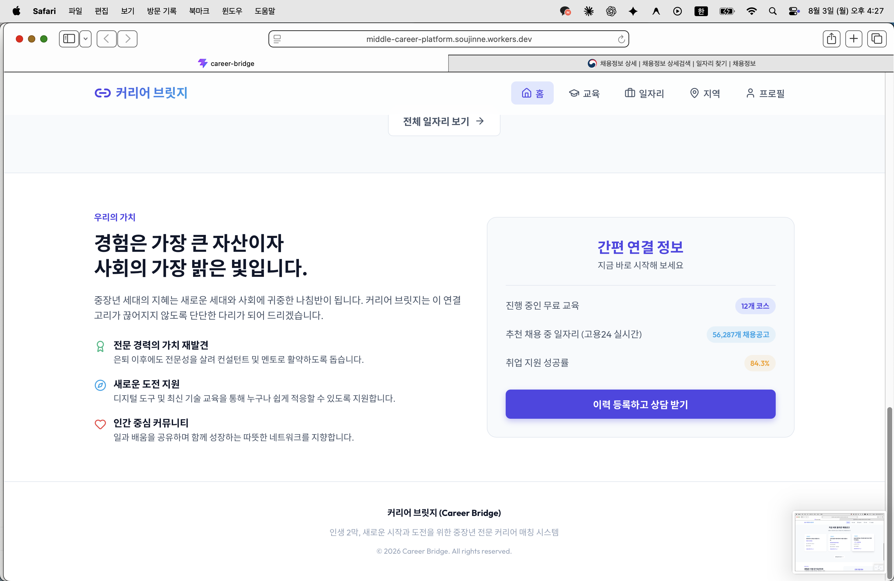
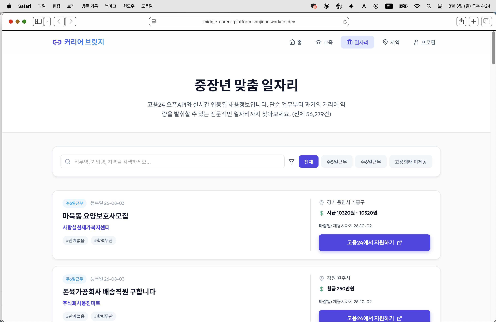
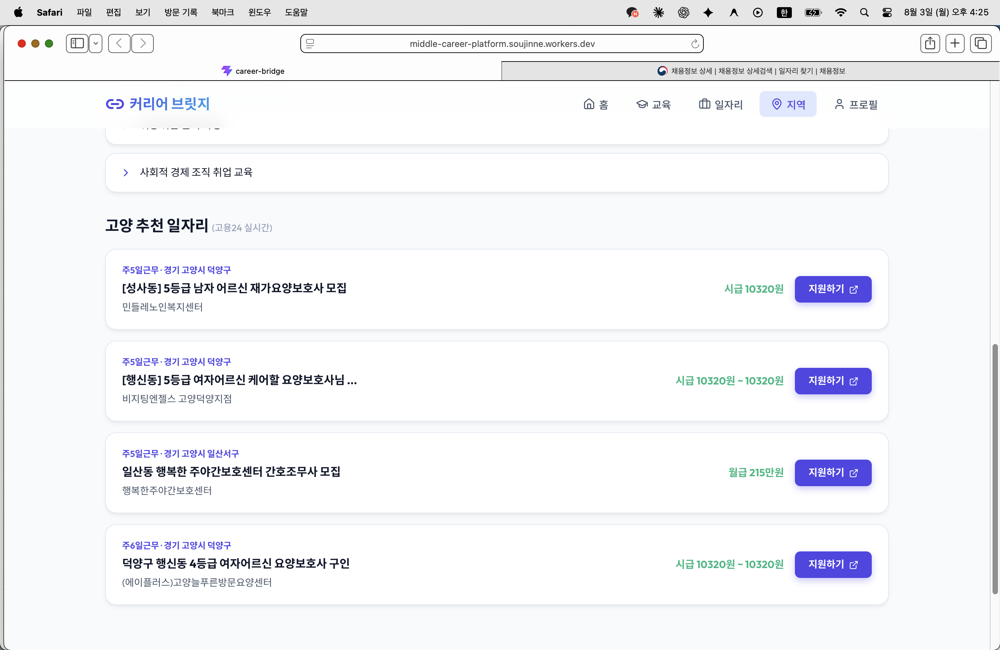

# 고용24 API 연동 결과 및 후속작업 보고서

**프로젝트명:** 중장년 커리어 브릿지 (Career Bridge)
**작성일:** 2026년 8월 1일
**배포 사이트:** https://middle-career-platform.soujinne.workers.dev

---

## 1. 개요

기존 프로토타입(1차 제출)에서는 홈·일자리·지역 화면의 채용정보가 모두 예시(mock) 데이터였습니다.
이번 작업에서는 **고용24 오픈API(work24.go.kr)** 에 정식으로 인증키를 발급받아, 실제 채용공고 데이터를
사이트에 실시간으로 연동했습니다.

---

## 2. 고용24 API 연동 내용

### 2.1 기술 구조

| 항목 | 내용 |
|---|---|
| 데이터 출처 | 고용24 오픈API - 채용정보(목록) API (`callOpenApiSvcInfo210L01.do`) |
| 연동 방식 | Cloudflare Worker를 중계 서버로 두어, 화면(React)이 아닌 서버에서 고용24 API를 호출 |
| 이유 | 브라우저에서 직접 호출 시 인증키 노출 위험 및 CORS(접속 차단) 문제 발생 → 서버 중계로 해결 |
| 인증키 보관 | Cloudflare Worker 환경변수(Secret)로 등록, 코드/저장소에는 노출되지 않음 |
| 응답 처리 | XML 응답을 서버에서 파싱하여 화면이 쓰기 좋은 JSON 형태로 가공 후 전달 |

### 2.2 실제 반영된 화면

- **홈 화면**
  - 기존에 고정 숫자로 넣어두었던 "OO개 채용공고" 문구를 고용24 실시간 총 건수로 교체
  - "지금 새로 올라온 채용공고" 코너 신설 — 최신 채용공고 3건을 실제 데이터로 카드 노출 (기업명, 지역, 급여, 고용24 원문 링크 포함)

  

  
  *"추천 채용 중 일자리" 항목이 고용24 실시간 건수(56,287개)로 자동 반영*

- **일자리 화면**
  - 예시로 넣어두었던 6개 고정 채용공고를 삭제하고, 고용24 실시간 채용정보로 전면 교체
  - 검색창 입력 시 화면에 이미 불러온 목록이 아니라 **고용24 전체 데이터(약 6만여 건)** 를 대상으로 서버에서 재검색
  - 채용유형 필터는 실제 데이터에서 추출한 값으로 동적 구성
  - "고용24에서 지원하기" 버튼으로 실제 채용공고 원문 페이지 연결

  
  *실제 배포 화면: 전체 56,279건 실시간 반영, 지역·급여·지원 링크까지 실제 데이터로 표시*

- **지역 화면 (고양·파주)**
  - 지역별 추천 일자리를 예시 데이터가 아닌, 고용24 데이터 중 실제 근무지역이 해당 지역명을 포함하는 공고로 실시간 구성

  
  *실제 배포 화면: "고양" 지역으로 필터링된 실제 채용공고 (근무지역까지 정확히 표시)*

### 2.3 진행 중 확인/보완한 사항

- 고용24 응답 필드명이 사전 문서만으로는 명확하지 않아, 실제 응답을 직접 확인해가며 회사명·근무지역·급여·마감일 등 필드 매핑을 검증 및 수정
- 응답 텍스트의 특수문자(예: `&lt;`) 표시 오류 수정
- 지역명은 API의 `keyword` 검색(제목 기준)만으로는 잘 걸러지지 않아, 최신 공고 여러 페이지를 훑어 실제 근무지역 값으로 직접 필터링하는 방식으로 개선

---

## 3. 학습조직 논의 반영 사항 (상담 선생님 검토용 자료)

학습조직 논의에서 "워크넷/고용24 외에 실제 현장에서 참고되는 사이트들이 있다"는 의견이 나와,
아래 두 개 리스트를 별도로 정리하여 중장년 전문 상담 선생님들께 검토를 요청드렸고,
**"이 정도면 충분하다"는 확인**을 받았습니다. (사이트에는 아직 미반영, 후속작업으로 진행 예정)

### 3.1 중장년 특화 채용사이트 리스트

| 분야 | 사이트 |
|---|---|
| 종합 중장년·시니어 채용 | 원더풀시니어(senior.saramin.co.kr), 서울시 50+포털(50plus.or.kr), 알바몬 중장년관 |
| 요양보호사·간병·간호 | 너스잡(nursejob.co.kr), 케어파트너, 엔젤시터, 요양나라, 한국요양보호협회, 복지넷 |
| 주택관리(관리소장) | 대한주택관리사협회(khma.org), 한국주택관리협회(kabma.or.kr) |
| 경비·시설관리 | 한국경비협회, 대한민국경비협회, 시설잡 |

### 3.2 중장년 교육 참고사이트 리스트 (고양·파주·김포)

| 지역 | 사이트 |
|---|---|
| 고양시 | 고양시 평생학습포털, **고양시 신중년대학**(50~65세 대상, 관내 대학 연계, 중부대학교 위탁운영) |
| 파주시 | 파주시 평생교육포털, 파주시노인복지관 평생학습 프로그램 |
| 김포시 | 김포시 평생교육 통합 플랫폼(gseek), 김포대학교 평생교육원 |

> 참고: 위 사이트들은 고용24와 달리 정식 오픈API가 없는 일반 홈페이지/게시판 형태이므로,
> 실시간 데이터 연동이 아닌 **"관련 사이트 바로가기" 형태의 외부 링크 안내**로 사이트에 반영할 예정입니다.

---

## 4. 후속작업 준비 현황

| 과제 | 상태 |
|---|---|
| 고용24 채용정보 API 연동 (홈/일자리/지역) | 완료 |
| 특화 채용사이트 리스트 정리 및 상담 선생님 검토 | 완료 (확인 받음) |
| 교육 참고사이트 리스트 정리 및 상담 선생님 검토 | 완료 (확인 받음) |
| 위 리스트를 사이트 내 "관련 사이트 바로가기" 코너로 반영 | 예정 |
| AI 질문창(Gemini 연동) 등 추가 기능 | 보류 (우선순위 밀림) |
